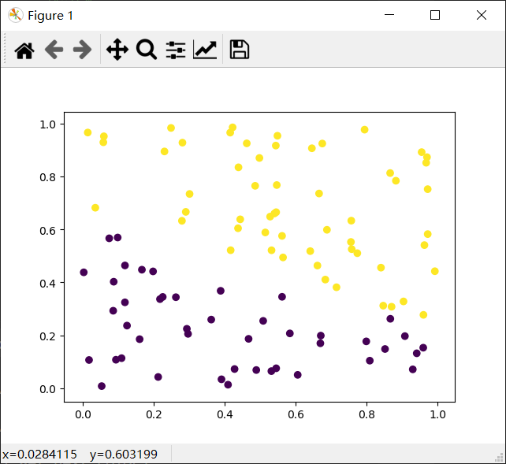

# 聚类

## 相关概念
* 无监督学习:是机器学习的一种方法，没有给定事先标记过的训练示例，自动对输入的数据进行分类或分群。
* 聚类:聚类是一种无监督学习。聚类是把相似的对象通过静态分类的方法分成不同的组别或者更多的子集，这样让在同一个子集中的成员对象都有相似的一些属性，常见的包括在坐标系中更加短的空间距离等。

## 性能度量
* 在机器学习中我们都需要对任务进行评价以便于进行下一步的优化，聚类的性能度量主要有一下两种。
  * 外部指标：是指把算法得到的划分结果跟某个外部的“参考模型”（如专家给出的划分结果）比较
  * 内部指标：是指直接考察聚类结果，不利用任何参考模型的指标。

## 距离计算
* 在机器学习和数据挖掘中，我们经常需要知道个体间差异的大小，进而评价个体的相似性和类别。
  * 欧式距离(2-norm距离)(两点的距离公式):$d(x,y)=\sqrt{\Sigma_{k=1}^n (x_k-y_k)^2}$
  * 曼哈顿距离(Manhattan distance, 1-norm距离):$d(x,y)=\Sigma_{k=1}^n \left|x_k-y_k\right|$
  * 切比雪夫距离:$d(x,y) = \lim_{n\rightarrow \infty} (\Sigma_{k=1}^n (\left|x_k-y_k\right|)^r)^\dfrac{1}{r} = max_k (\left|x_k-y_k\right|)$
  * 闵可夫斯基距离:$d(x,y)=(\Sigma_{k=1}^n (\left|x_k-y_k\right|)^r)^\dfrac{1}{r}$
  * 式中，r是一个可变参数，根据参数r取值的不同，闵可夫斯基距离可以表示一类距离  
    * r = 1时，为曼哈顿距离  
    * r = 2时，为欧式距离  
    * r →∞时，为切比雪夫距离  
    * 闵可夫斯基距离包括欧式距离、曼哈顿距离、切比雪夫距离都假设数据各维属性的量纲和分布（期望、方差）相同，因此适用于度量独立同分布的数据对象。
  * 余弦相似性:$cos⁡(x,y)=\dfrac{xy}{\left|x\right|\left|y\right|} = \dfrac{\Sigma_{k=1}^n x_k y_k}{\sqrt{\Sigma_{k=1}^n x_k^2} \sqrt{\Sigma_{k=1}^n y_k^2}}$
    * 余弦相似度实际上是向量xx和yy夹角的余弦度量，可用来衡量两个向量方向的差异。如果余弦相似度为11，则xx和yy之间夹角为0°0°，两向量除模外可认为是相同的；如果预先相似度为00，则xx和yy之间夹角为90°90°，则认为两向量完全不同。在计算余弦距离时，将向量均规范化成具有长度11，因此不用考虑两个数据对象的量值。
    *  余弦相似度常用来度量文本之间的相似性。文档可以用向量表示，向量的每个属性代表一个特定的词或术语在文档中出现的频率，尽管文档具有大量的属性，但每个文档向量都是稀疏的，具有相对较少的非零属性值。 
  * 马氏距离: $mahalanobis(x,y)=(x-y)\Sigma^{-1}(x-y)^T$
    * 式中，Σ−1Σ−1是数据协方差矩阵的逆。
    * 前面的距离度量方法大都假设样本独立同分布、数据属性之间不相关。马氏距离考虑了数据属性之间的相关性，排除了属性间相关性的干扰，而且与量纲无关。若协方差矩阵是对角阵，则马氏距离变成了标准欧式距离；若协方差矩阵是单位矩阵，各个样本向量之间独立同分布，则变成欧式距离。 

## K均值聚类
``` python
def distEclud(vecA, vecB):
    '''
    欧氏距离计算函数
    :param vecA:
    :param vecB:
    
    :return: float 
    '''
    dist = 0.0
    # ========= show me your code ==================
    dist = np.sqrt(np.sum((vecA - vecB)**2))
    # here
    # ========= show me your code ==================
    return dist

def randCent(dataMat, k):
    '''
    为给定数据集构建一个包含K个随机质心的集合,
    随机质心必须要在整个数据集的边界之内,这可以通过找到数据集每一维的最小和最大值来完成
    然后生成0到1.0之间的随机数并通过取值范围和最小值,以便确保随机点在数据的边界之内
    :param np.dataMat:
    :param k:
    
    :return: np.dataMat
    '''
    # 获取样本数与特征值
    m, n = np.shape(dataMat)
    # 初始化质心,创建(k,n)个以零填充的矩阵
    centroids = np.mat(np.zeros((k, n)))
    # ========= show me your code ==================
    # 循环遍历特征值
    # here
    value_max = []
    value_min = []
    for i in range(n):
        value_max.append(max(dataMat[:,i]))
        value_min.append(min(dataMat[:,i]))
    for i in range(k):
        for j in range(n):
            centroids[i,j] = random.random() * (value_max[j] -value_min[j]) + value_min[j]
    
    # ========= show me your code ==================
    
    # 返回质心
    return centroids.A


def kMeans(dataMat, k, distMeas=distEclud):
    '''
    创建K个质心,然后将每个点分配到最近的质心,再重新计算质心。
    这个过程重复数次,直到数据点的簇分配结果不再改变为止
    :param dataMat: 数据集
    :param k: 簇的数目
    :param distMeans: 计算距离
    :return:
    '''
    # 获取样本数和特征数
    m, n = np.shape(dataMat)
    # 初始化一个矩阵来存储每个点的簇分配结果
    # clusterAssment包含两个列:一列记录簇索引值,第二列存储误差(误差是指当前点到簇质心的距离,后面会使用该误差来评价聚类的效果)
    clusterAssment = np.mat(np.zeros((m, 2)))
    # 创建质心,随机K个质心
    centroids = randCent(dataMat, k)

    # 初始化标志变量,用于判断迭代是否继续,如果True,则继续迭代
    clusterChanged = True
    while clusterChanged:
        clusterChanged = False
        # 遍历所有数据找到距离每个点最近的质心,
        # 可以通过对每个点遍历所有质心并计算点到每个质心的距离来完成
        for i in range(m):
            minDist = float("inf")
            minIndex = -1
            for j in range(k):
                # 计算数据点到质心的距离
                # 计算距离是使用distMeas参数给出的距离公式,默认距离函数是distEclud
                distJI = distMeas(centroids[j, :], dataMat[i, :])
                # 如果距离比minDist(最小距离)还小,更新minDist(最小距离)和最小质心的index(索引)
                if distJI < minDist:
                    minDist = distJI
                    minIndex = j
            
            # 如果任一点的簇分配结果发生改变,则更新clusterChanged标志
            # ========= show me your code ==================
            # here
            if clusterAssment[i, 0] != minIndex: 
                clusterChanged = True
            
            # ========= show me your code ==================
            
            # 更新簇分配结果为最小质心的index(索引),minDist(最小距离)的平方
            clusterAssment[i, :] = minIndex, minDist ** 2
        # print(centroids)
        
        
        # 遍历所有质心并更新它们的取值
        # ========= show me your code ==================
        for i in range(k):
            temp = dataMat[np.nonzero(clusterAssment[:, 0] == i)[0]]
            centroids[i,:] = np.mean(temp,axis=0) 
        # here
        # ========= show me your code ==================
    
    # 返回所有的类质心与点分配结果
    return centroids, clusterAssment
```
* 结果如图：

