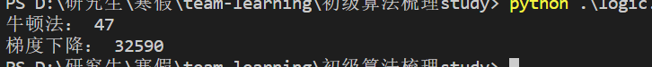

# 逻辑回归

## 逻辑回归与线性回归的联系与区别

* 区别：
  * 线性归回要求自变量与因变量呈线性关系，而逻辑回归没有要求
  * 逻辑回归处理的是分类问题，线性回归处理的是回归问题，这也导致了两个模型的取值范围不同：0-1和实数域
* 联系：
  * 两个都是线性模型，线性回归是普通线性模型，逻辑回归是广义线性模型
  
## Sigmoid函数

* 当为1的概率大于0.5时，判断为1，当为1的概率小于0.5时，判断为0
  
* $h(z) = \frac{1}{1+e^{-z}}$

## 逻辑回归损失函数推导及优化

$P(y=1|x;\theta) = h_\theta(x)$
$P(y=0|x;\theta) = 1 - h_\theta(x)$
- 可以写作一般公式：
$P(y|x;\theta)= h(x)^y (1-h(x))^{(1-y)}$
- 极大似然函数为：
$L(\theta) = \prod^{m}_{i=1}h_\theta (x^{(i)})^{y^{(i)}} (1-h_\theta (x^{(i)})^{(1-y^{(i)})}$
- 对数极大似然估计为：
$l(\theta) = log L(\theta) = \sum^{m}_{i=1} y^{(i)}log h_\theta (x^{(i)}) + (1-y^{(i)})log (1-h_\theta (x^{(i)}))$
- 损失函数为：
$J(\theta) = -\frac{1}{m}l(\theta) = -\frac{1}{m}\sum^{m}_{i=1} y^{(i)}h_\theta (x^{(i)}) + (1-y^{(i)})(1-h_\theta (x^{(i)}))$

* 损失函数表示了预测值和真实值之间的差异程度，预测值和真实值越接近，则损失函数越小。

* 损失函数的导数：$g'_\theta(z) = g_\theta (z)(1-g_\theta(z))$

## 正则化函数
* 我们可以在损失函数后面，加上正则化函数，即$θ$的惩罚项，来抑制过拟合问题。
* L1正则:是指权值向量$w$中各个元素的绝对值之和 它的优良性质是能产生稀疏性，导致W中许多项变成零。 稀疏的解除了计算量上的好处之外，更重要的是更具有“可解释性”。

* L2正则：是指权值向量
$w$中各个元素的平方和然后再求平方根。他的原理是使得模型的解偏向于范数较小的W，通过限制W范数的大小实现了对模型空间的限制，从而在一定程度上避免了 overfitting 

## 逻辑回归的评价指标
* 逻辑回归模型属于分类模型，不能用线性回归的评价指标。 二元分类的评价指标基本都适用于逻辑回归。
* 如以下混淆矩阵：
   混淆矩阵|Predicted as Positive|Predicted as Negative
    |:-:|:-:|:-:|
    |Labeled as Positive|True Positive(TP)|False Negative(FN)|
    |Labeled as Negative|False Positive(FP)|True Negative(TN)|
* 可以使用查准率和查全率来评价预测结果：
  * 查准率$P=\frac{TP}{TP+FN}$
  * 查全率$R=\frac{TP}{TP+FP}$
* 查准率和查全率经常相互矛盾，一般查准率高时查全率低，查全率高时查准率低。我们经常针对具体的应用场景决定更看重哪一个指标。

## 逻辑回归的优缺点
* 优点：
  * 可以很好解决二分类问题
* 缺点：
  * 预测结果呈Z字型（或反Z字型），因此当数据集中在中间区域时，对概率的变化会很敏感，可能使得预测结果缺乏区分度
  * 逻辑回归依然是线性划分，对于非线性的数据集适应性弱。

## 代码如下：
* 梯度下降
``` python
class LGR_GD():
    def __init__(self):
        self.w = None 
        self.n_iters = None
    def fit(self,X,y,alpha=0.03,loss = 1e-10): # 设定步长为0.002，判断是否收敛的条件为1e-10
        y = y.reshape(-1,1) #重塑y值的维度以便矩阵运算
        [m,d] = np.shape(X) #自变量的维度
        self.w = np.zeros((1,d)) #将参数的初始值定为0
        tol = 1e5
        self.n_iters = 0
        #============================= show me your code =======================
        while tol > loss: #设置收敛条件
            h_x = 1/(1 + np.exp(-X.dot(self.w.T)))
            temp = alpha * np.mean(X * (y - h_x),axis = 0)
            self.w = self.w + temp
            tol = np.sum(np.abs(temp))
            self.n_iters += 1 #更新迭代次数
         #============================= show me your code =======================
    def predict(self, X):
        # 用已经拟合的参数值预测新自变量
        y_pred = X.dot(self.w)
        return y_pred  
```
* 牛顿法
``` python
    class LGR_NT():
    def __init__(self):
        self.w = None
        self.n_iters = None
    def fit(self,X,y,loss = 1e-10): # 判断是否收敛的条件为1e-10
        y = y.reshape(-1,1) #重塑y值的维度以便矩阵运算
        [m,d] = np.shape(X) #自变量的维度
        self.w = np.zeros((1,d)) #将参数的初始值定为0
        tol = 1e5
        n_iters =0
        Hessian = np.zeros((d,d))
        #============================= show me your code =======================
        while tol > loss:
            h_x = 1/(1+np.exp(-X.dot(self.w.T)))
            grad = np.mean(X*(y - h_x),axis=0)
            for i in range(d):
                for j in range(d):
                    if j>=i:
                        Hessian[i][j] = np.mean(h_x*(h_x-1)*X[:,i]*X[:,j]) 
                    else:
                        Hessian[i][j] = Hessian[j][i]
            temp = np.linalg.inv(Hessian).dot(grad)
            self.w = self.w - temp
            tol = np.sum(np.abs(temp))
            n_iters += 1
        #============================= show me your code =======================
        self.n_iters = n_iters
        
    def predict(self, X):
        # 用已经拟合的参数值预测新自变量
        y_pred = X.dot(self.w)
        return y_pred  
```
* 梯度下降和牛顿法结果比较
    
