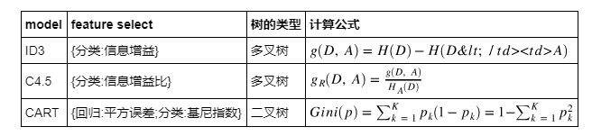
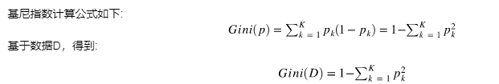

这篇博客主要介绍了一个自己实现的基于基尼指数的分类决策树，训练和测试数据选择sklearn中的IRIS(鸢尾花)数据集。训练测试代码主要为：
```python
import numpy as np
from sklearn.datasets import load_iris
from sklearn.model_selection import train_test_split

if __name__ == "__main__":
    # 分类树
    X, y = load_iris(return_X_y=True)

    X_train, X_test, y_train, y_test = train_test_split(X, y, test_size=0.2)

    clf = DecisionTreeClassifier()

    clf.fit(X_train, y_train)

    print ("Classifier Score:", clf.score(X_test, y_test))
```
# 概念介绍
## 决策树

**决策树定义及分类**

决策树就是把若干个if-then条件组合成树的结构,在这个过程中if的选择也就是特征选择会影响决策树的损失函数，不同的特征选择算法生成了不同的决策树模型。  
常见的决策树模型有以下三种（其中CART既可以做分类任务也可以做回归任务） 



**如何构建决策树**

以(ID3,C4.5)决策树为例，构建决策树的伪算法是：
> 输入:数据集D，特征集合A，阈值e  
> 输出:决策树T  
> 1、如果D中所有实例输出同一类$C_k$, 则T作为单节点树，并将类$C_k$作为该节点的类标记，返回T;  
> 2、若$A=\varnothing$,则T为单节点树，将D中实例数最多的类$C_k$作为该节点的类标记，返回T  
> 3、否则，根据信息增益(ID3)或者信息增益比(C4.5)计算特征A对D的值，选择当前最优的特征$A_g$;  
> 4、如果$A_g$的信息增益小于阈值e，则置T为单节点数，并将D中实例最多的类$C_k$作为当前的类标记，返回T；  
> 5、否则，根据$A_g$中的每一个不同的$a_i$,根据$A_g=a_i$将D分成若干个非空子集，对于第i个子节点，以$D_i$为数据集，以$A-{A_g}$为特征集，递归(重复3-6)构造决策树$T_i$,返回$T_i$.  
> 6、对决策树模型T进行剪枝.  

**剪枝**

在之前构建决策树的过程中，我们只考虑了在训练数据上的经验风险最小化，这可能会出现过拟合问题，为了解决过拟合的问题，我们引入贪心的思想来进行剪枝，因为剪掉了一个节点,虽然经验风险增加了但是模型复杂度降低了,就更可能拟合测试数据。  
剪枝的主要算法思想是
> 计算每个节点的经验熵  
> 递归从树的叶节点向上回溯，假设将某个叶节点回缩到其父节点前后的整体树对应的$T_B$和$T_A$,对应的损失分别是$C_{\alpha}(T_B)$和$C_{\alpha}(T_A)$，如果: $C_{\alpha}(T_A) \leq C_{\alpha}(T_B)$ 表示，剪掉之后，损失减小，就进行剪枝  
重复2，直到不能继续为止，得到损失函数最小的子树$T_{\alpha}$.
# 关键代码
**预测一个样例的返回结果**
```python
def __predict_one(self, input_x):
        """预测一个样例的返回结果.
        
        Paramters:
        ---------
        input_x : list or np.ndarray
            需要预测输入数据
        
        Returns:
        -------
        class : 对应的类
        """
        
        tree = self.decision_tree
        p = root
        while p.label is None:
            if input_x[p.feat] == p.val:
                p = p.left 
            else:
                p = p.right
        pre_y = p.label
        return pre_y
```

**递归构建决策树**
```python
    def __build_tree(self, data, depth):
        """创建决策树的主要代码
        
        Paramters:
        ---------
        data : {array-like} of shape (n_samples, n_features) + {label}
            The training input samples. Internally, it will be converted to
            ``dtype=np.float32``
        
        depth: int, 树的深度
        
        Returns:
        -------
        DecisionTree
            
        """        
        labels = np.unique(data[:,-1])
        # 只剩下唯一的类别时,停止,返回对应类别
        if len(labels) == 1:
            return DecisionTree(result=list(labels)[0])
        
        # 遍历完所有特征时,只剩下label标签,就返回出现字数最多的类标签
        if not self.all_feats:
            return DecisionTree(result=np.argmax(np.bincount(data[:,-1].astype(int))))

        # 超过最大深度,则停止,使用出现最多的参数作为该叶子节点的类
        if self.max_depth and depth > self.max_depth:
            return DecisionTree(result=np.argmax(np.bincount(data[:,-1].astype(int))))

        # 如果剩余的样本数大于等于给定的参数 min_samples_split,
        # 则不在进行分割, 直接返回类别中最多的类,该节点作为叶子节点
        if self.min_samples_split >= data.shape[0]:
            return DecisionTree(result=np.argmax(np.bincount(data[:,-1].astype(int))))

        # 叶子节点个数小于指定参数就进行返回,叶子节点中的出现最多的类
        if self.min_samples_leaf >= data.shape[0]:
            return DecisionTree(result=np.argmax(np.bincount(data[:,-1].astype(int))))
        
        # 根据基尼指数选择每个分割的最优特征
        best_idx, best_val, min_gini = self.__getBestFeature(data)
        # print ("Current best Feature:", best_idx, best_val, min_gini)
        # 如果当前的gini指数小于指定阈值,直接返回
        if min_gini < self.min_impurity_split:
            return DecisionTree(result=np.argmax(np.bincount(data[:,-1].astype(int))))
        
        leftData, rightData = self.__splitData(data, best_idx, best_val)
        
        depth += 1
        leftDecisionTree = __build_tree(leftData, depth)
        rightDecisionTree = __build_tree(rightData, depth)
        
        return DecisionTree(col=best_idx, val=best_val, LeftChild=leftDecisionTree, RightChild=rightDecisionTree)


```

**得到最优特征对应的列**
```python
    def __getBestFeature(self, data):
        """得到最优特征对应的列
        Paramters:
        ---------
        data: np.ndarray
            从data中选择最优特征
            
        Returns:
        -------
        bestInx, val, 最优特征的列的索引和使用的值.
        """
        best_idx = -1
        best_val = None
        min_gini = 1.0                
        totalGini = gini(data)
        total_num = shape(data)[0]
        for feature in range(shape(data)[1] - 1):
            allValues = [d[feature] for d in data]
            values = set(allValues)
            for value in values:
                left_child, right_child = splitByFeatVal(feature, value, dataSet)
                if(shape(left_child)[0] == 0 or shape(right_child)[0] == 0): continue
                left_num = shape(left_child)[0]
                right_num = shape(right_child)[0]
                cur_gini = left_num / total_num * gini(left_child) + \
                        right_num / total_num * gini(right_child)
                if(cur_gini < min_gini):
                    best_idx = feature
                    bestValue = value
                    min_gini = cur_gini
        # 删除使用过的特征
        self.all_feats.remove(best_idx)
        
        return best_idx, best_val, min_gini
        

```

**计算基尼指数**  


```python
def gini(self, labels):
    totalNum = shape(labels)[0]
    labelNum = {}
    gini = 0
    for data in labels:
        label = data[-1]
        if label in labelNum:
            labelNum[label] += 1
        else:
            labelNum[label] = 1
 
    for key in labelNum:
        p = labelNum[key] / totalNum
        gini += p * (1 - p)
    return gini
```